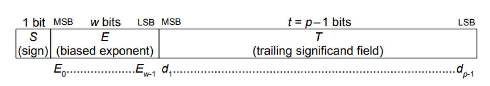
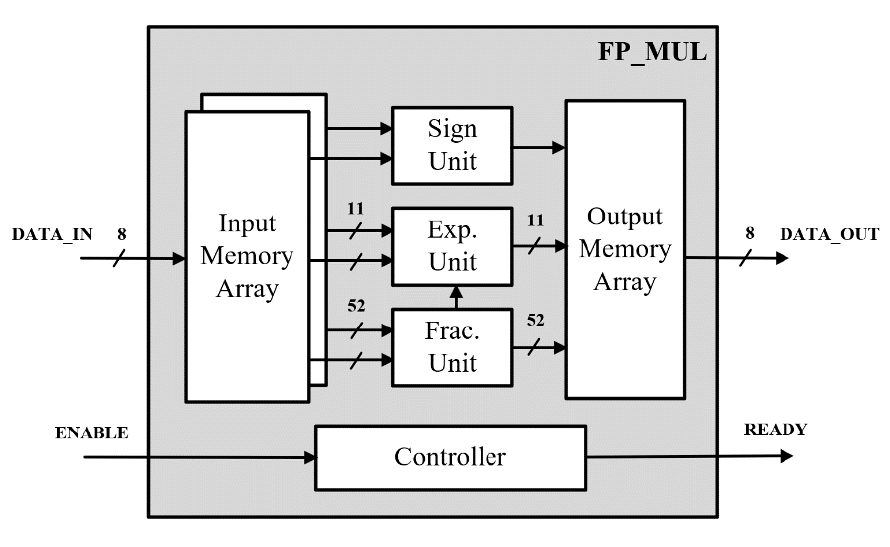
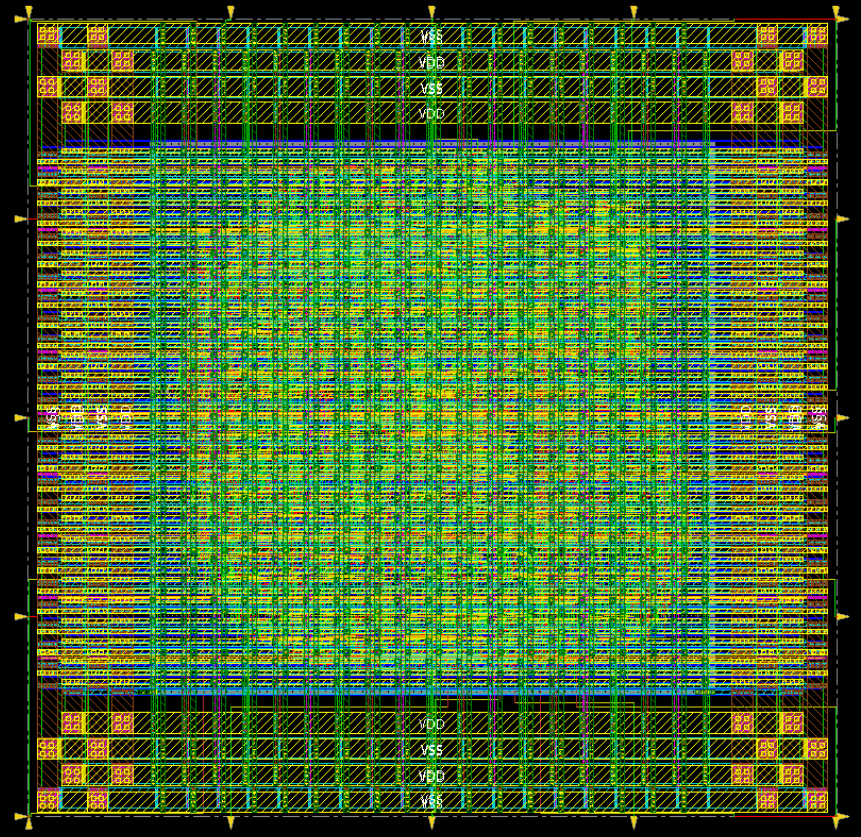

# low-power-fp-multiplier

- 🚀 **Rank 1/72 in Power Efficiency** -- This design achieved **the lowest power consumption** in DIC course in CCU <br>
- This project implements a **low-power IEEE-754 double-precision floating-point multiplier**, designed in **TSMC 16nm** technology.
while completing the full **RTL-to-GDS chip design flow**.

### Key optimizations
📌 `RTL-Level` &nbsp;: &nbsp; reduced bias operations, memory array storage,
    using sequential multiplier IP → **~71% power↓** 🚀 <br>
📌 `Synthesis-Level` &nbsp;: &nbsp; clock gating, power-weight constraints → **~58% power↓** 🚀 <br> 

## ⏩ 1) Overview

Representations of floating-point data in the binary
interchange formats are uniquely encoded in k bits in the following three fields ordered as shown in Figure. <br>
<br>
<p align="center">

</p>
a) &nbsp; 1-bit sign S <br>
b) &nbsp; w-bit biased exponent E= e + bias <br>
c) &nbsp; (t=p−1)-bit trailing significand field digit string T=d1 d2…dp−1; the leading bit of the significand,
d0, is implicitly encoded in the biased exponent E. <br>


## ⏩ 2) Hardware Architecture

-   **Sign Unit** -- XOR-based sign calculation
-   **Exponent Unit** -- bias-optimized arithmetic
-   **Fraction Unit** -- implemented with `CW_mult_seq` IP for power and
    area reduction

<p align="center">
`
</p>

## ⏩ 3) Implementation Flow

✅ RTL Simulation -- passed with no errors <br>
✅ Synthesis -- met 1.0 GHz timing & power goals <br>
✅ APR -- optimized placement & routing <br>
✅ DRC/LVS -- no DRC error & LVS pass <br>
✅ Post-Layout Simulation -- max frequency 1.136 GHz <br>

<p align="center">

</p>

## ⏩ 4) Results Summary

| Metric                           | Result / Notes                                     |
|----------------------------------|----------------------------------------------------|
| Max Clock Frequency (post‑layout)| 1.136 GHz                                          |
| Latency                          | 58 clock cycles                                    |
| Core Area                        | 2.982k μm²                                         |
| Power                            | **0.5563 mW** (lowest in DIC course)               |

## ⏩ 5) Repository Structure 

```
├─ rtl/                  # Verilog design source & testbench
├─ syn/                  # Synthesis constraints (.sdc) & reports
├─ apr/                  # P&R setup, floorplan, reports
└─ img/                  # Block diagrams, timing, waveforms
```
## ⏩ 6) References 
[1] IEEE Standard for Floating-Point Arithmetic, IEEE Std 754-2019, Jul. 22, 2019.

## ⏩ 7) Reflection 
This project highlights the **trade-offs between latency and power**.
By strategically increasing latency, I achieved **the lowest power
design (Rank 1/72)** while still meeting the 1.0 GHz target.
