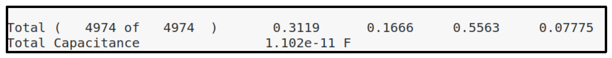

# low-power-fp-multiplier

🚀 **Rank 1/72 in Power Efficiency** -- This project implements a
**low-power IEEE-754 double-precision floating-point multiplier**,
designed in **TSMC 16nm** technology.\
The design achieved **the lowest power consumption in class**, while
completing the full **RTL-to-GDS chip design flow**.

## 📌 Key Achievements

-   **Process:** TSMC 16nm
-   **Core Area:** 2.982k μm²
-   **Power Consumption:** **0.5563 mW (Rank 1/72, lowest in DIC course)**
-   **Latency:** 58 cycles
-   **Max Frequency:** 1.136 GHz (post-layout)

## ⚙️ Hardware Architecture

-   **Sign Unit** -- XOR-based sign calculation
-   **Exponent Unit** -- bias-optimized arithmetic
-   **Fraction Unit** -- implemented with `CW_mult_seq` IP for power and
    area reduction

`

## 🔧 Optimization Highlights

-   **RTL-Level:** reduced bias operations, memory array storage,
    sequential multiplier IP\
-   **Synthesis-Level:** clock gating, power/power-weight constraints,
    synthesis optimizations\
-   **Result:** Achieved **60%+ power reduction** compared to naive
    design

## 📐 RTL-to-GDS Flow

-   ✅ RTL Simulation -- passed with no errors
-   ✅ Synthesis -- met 1.0 GHz timing & power goals
-   ✅ APR -- optimized placement & routing
-   ✅ DRC/LVS -- clean signoff
-   ✅ Post-Layout Simulation -- max frequency 1.136 GHz

## 📊 Final Power Result

Final post-layout analysis: **0.5563 mW (lowest in DIC course, Rank 1/72)**

## 💡 Reflection

This project highlights the **trade-offs between latency and power**.\
By strategically increasing latency, I achieved **the lowest power
design (Rank 1/72)** while still meeting the 1.0 GHz target -- proving
the effectiveness of **RTL-level and synthesis-level optimizations** in
modern ASIC design.
